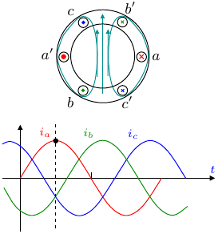
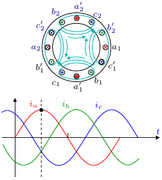

# Electrical machines visuals

Supplementary materials for teaching & learning "Electrical machines".

## Folder: DC_machines 
### Sketchup models for DC machines:
| `Machine` | `Image`| `Video capture`|
| :-------------: |:-------------:|:-------------:|
| `DC motor`|      |   |
|`DC generator`|   | |
|  |   |   |
****

## Folder: Synchronous_machine
### Sketchup models for Synchronous machines (SM):

| `Machine` | `Image`| `Video capture`|
| :-------------: |:-------------:| :-------------:|
| `Cylindrical rotor SM`|  |  |
| | |
| `Salient (2-poles) rotor SM`     | |  |
| `Salient (4-poles) rotor SM` |  | |
|  |   |   |

****

## Folder: Induction_machines
### Sketchup models for Induction machines:

| `Content` | `Image`| `Video capture`|
| :-------------: |:-------------:| :-------------:|
|  `Single-phase alternating field`|  |   |
|  `Three-phase rotating field` |  |   |
|  `Squirrel cage IM` |  |  |
|  `Wound rotor IM` |  |  |

****

### Xfig files for rotating field animation:

| `In 2-pole structure`| `In 4-pole structure`       |
| :-------------: |:-------------:|
|       |  |
| | |
 

